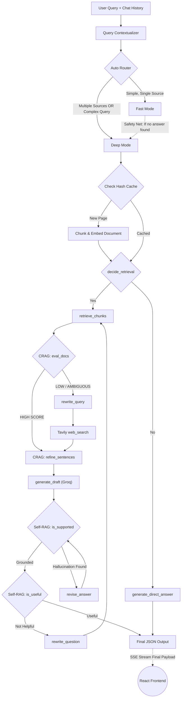

# ThinkTab AI — Backend Implementation Plan

> A complete, detailed technical blueprint for the FastAPI + LangGraph backend powering the ThinkTab AI Chrome Extension.

---

## 🎯 Project Overview

ThinkTab AI is an advanced browser-based AI assistant that:
- Understands the content of the current webpage
- Reasons across multiple tabs and uploaded documents (PDF/DOC)
- Uses a **Hybrid RAG architecture (CRAG + Self-RAG)** to produce accurate, hallucination-free answers
- Returns structured output with Answer + Evidence Snippets + Confidence Score
- Supports three intelligence modes: **Fast ⚡**, **Deep 🧠**, and **Auto 🤖**

---

## 🏗️ Tech Stack

| Layer | Technology |
|---|---|
| Web Framework | FastAPI (with Uvicorn ASGI server) |
| Streaming | Server-Sent Events (SSE) via `sse-starlette` |
| AI Orchestration | LangGraph (`StateGraph`) |
| AI Utilities | LangChain |
| Vector Store | FAISS (ephemeral, in-memory, per-session) |
| Embeddings | Google Generative AI Embeddings (`models/gemini-embedding-001`) |
| LLM (Routing & Filtering) | `gpt-4o-mini` via **OpenRouter** |
| LLM (Final Generation) | `GPT OSS 120B` via **Groq** |
| Re-Ranking | `BAAI/bge-reranker-base` (local, cross-encoder) or **Cohere Rerank API** |
| Web Search Fallback | **Tavily Search API** |
| Observability | **LangSmith** (tracing, debugging, latency tracking) |
| Environment | Python `python-dotenv`, `pydantic-settings` |

---

## 📁 Full Project Folder Structure

```text
backend/
├── app/
│   ├── api/
│   │   ├── __init__.py
│   │   └── endpoints.py           # All FastAPI routes (SSE streaming endpoints)
│   ├── core/
│   │   ├── __init__.py
│   │   └── config.py              # API keys, model names, thresholds (pydantic-settings)
│   ├── graph/
│   │   ├── __init__.py
│   │   ├── state.py               # TypedDict GraphState definition
│   │   ├── auto_router.py         # Auto Mode Decision Layer
│   │   ├── fast_mode.py           # Fast Mode pipeline (LangChain only, no full graph)
│   │   ├── deep_mode.py           # Deep Mode full LangGraph StateGraph
│   │   └── nodes/
│   │       ├── __init__.py
│   │       ├── contextualizer.py  # Query contextualizer (resolves chat history refs)
│   │       ├── retrieval.py       # FAISS retrieval + re-ranking
│   │       ├── crag_evaluator.py  # CRAG doc scoring node
│   │       ├── crag_refiner.py    # Sentence-level refinement node
│   │       ├── web_search.py      # Tavily web search node
│   │       ├── generation.py      # Final answer + evidence generation (Groq)
│   │       └── self_rag.py        # IsSUP + IsUSE validation nodes
│   ├── services/
│   │   ├── __init__.py
│   │   ├── vector_store.py        # FAISS wrapper with LRU eviction
│   │   ├── llm_service.py         # LangChain LLM configs (OpenRouter + Groq)
│   │   └── embedder.py            # Chunk + embed + cache logic
│   └── main.py                    # FastAPI app entry point
├── .env                           # API keys (never commit to git)
├── requirements.txt
└── README.md
```

---

## 🔑 Environment Variables (`.env`)

```env
# LLM Providers
OPENROUTER_API_KEY=your_key_here
GROQ_API_KEY=your_key_here

# Google Embeddings
GOOGLE_API_KEY=your_key_here

# Web Search
TAVILY_API_KEY=your_key_here

# Observability
LANGSMITH_API_KEY=your_key_here
LANGCHAIN_PROJECT=thinktab-ai

# Config
EMBEDDING_MODEL=models/gemini-embedding-001
OPENROUTER_MODEL=openai/gpt-4o-mini
GROQ_MODEL=meta-llama/llama-3.3-70b-versatile
MAX_CACHE_PAGES=20
UPPER_CRAG_THRESHOLD=0.7
LOWER_CRAG_THRESHOLD=0.3
```

---

## 📦 `requirements.txt`

```text
fastapi
uvicorn[standard]
sse-starlette
python-dotenv
pydantic-settings
langchain
langchain-community
langchain-openai
langchain-google-genai
langgraph
langsmith
faiss-cpu
sentence-transformers
cohere
tavily-python
pypdf
python-multipart
```

---

## 📡 API Design (`endpoints.py`)

### POST `/api/chat` — Main Streaming Endpoint

Accepts the user message, selected mode, page contexts, and chat history.

**Request Body:**
```json
{
  "query": "Compare pricing across these two tabs",
  "mode": "auto",
  "contexts": [
    {"source_id": "stripe.com", "content": "...markdown text..."},
    {"source_id": "paypal.com", "content": "...markdown text..."},
    {"source_id": "my_doc.pdf", "content": "...extracted text..."}
  ],
  "chat_history": [
    {"role": "user", "content": "What is Stripe?"},
    {"role": "assistant", "content": "Stripe is a payment platform..."}
  ]
}
```

**Response:**  
A stream of Server-Sent Events (SSE) `data:` lines. Each event is a JSON object:

| Event Type | Payload Example |
|---|---|
| mode_selected | `{"type": "mode", "value": "Auto → Fast ⚡"}` |
| status_update | `{"type": "status", "value": "Evaluating document chunks..."}` |
| token | `{"type": "token", "value": "Stripe"}` (Fast Mode word-by-word) |
| final_answer | `{"type": "final", "answer": "...", "evidence": [...], "confidence": 0.91, "reasoning_summary": "..."}` |
| error | `{"type": "error", "message": "..."}` |

### POST `/api/embed` — Pre-embed a Document
Allows the extension to pre-process and cache a page when the user first loads it (non-blocking, background call).

### DELETE `/api/cache/{source_id}` — Invalidate Cache

---

## ⚡ Embedding Cache (`vector_store.py`)

One of the most critical performance features. We **never embed the same page content twice**.

### Strategy
```python
import hashlib
from collections import OrderedDict

class LRUEmbeddingCache:
    def __init__(self, max_size: int = 20):
        self.cache = OrderedDict()   # {content_hash: faiss_index}
        self.max_size = max_size

    def get_key(self, content: str) -> str:
        return hashlib.sha256(content.encode()).hexdigest()

    def get(self, key: str):
        # Move to end (most recently used)
        ...

    def set(self, key: str, faiss_index):
        # If full, pop oldest
        if len(self.cache) >= self.max_size:
            self.cache.popitem(last=False)
        ...
```

### Why `hash(content)` instead of URL?
- **Dynamic pages** (Twitter, Reddit): URL stays the same but content changes as the user scrolls. Content hash catches this correctly.
- **SPAs** (Single Page Applications like React apps, Gmail): URL might never change even across totally different views.
- **Navigation**: If the user opens the same Wikipedia article twice, we skip embedding entirely.

---

## 🧠 The LangGraph State (`state.py`)

This is the shared "memory" dictionary that every node in the graph can read from and write to.

```python
from typing import TypedDict, List, Literal, Optional
from langchain_core.documents import Document

class GraphState(TypedDict):
    # --- Input ---
    query: str
    original_query: str          # Preserved before contextualizer modifies it
    mode: Literal["fast", "deep", "auto"]
    selected_mode: Literal["fast", "deep"]   # Resolved by Auto Router
    chat_history: List[dict]
    contexts: List[dict]         # [{"source_id": "...", "content": "..."}]

    # --- Retrieval ---
    docs: List[Document]         # Raw retrieved chunks
    good_docs: List[Document]    # Chunks that passed CRAG scoring
    refined_context: str         # Sentence-level filtered clean text

    # --- CRAG State ---
    crag_verdict: Literal["CORRECT", "INCORRECT", "AMBIGUOUS"]
    web_query: str               # Rewritten query for web search
    web_docs: List[Document]     # Documents fetched from Tavily

    # --- Generation ---
    draft_answer: str            # Initial draft (not shown to user yet)
    final_answer: str            # Validated final answer
    evidence: List[dict]         # [{"source": "...", "snippet": "..."}]
    confidence_score: float      # 0.0 to 1.0
    reasoning_summary: str       # Short explanation of how the answer was derived

    # --- Self-RAG State ---
    is_supported: bool           # IsSUP: Is every claim backed by evidence?
    is_useful: bool              # IsUSE: Does the answer actually address the query?
    revision_retries: int        # Guard: max 2 IsSUP revision loops
    retrieval_retries: int       # Guard: max 2 full retrieval loops (via IsUSE)
```

---

## 🤖 Auto Mode Router (`auto_router.py`)

This layer runs **before** the LangGraph pipeline. It decides which pipeline to invoke.

### Decision Logic (in order of priority):

1. **Document Count Check** (0ms)  
   If `len(contexts) > 1` → force `Deep Mode`. Cross-document comparison always needs heavy reasoning.

2. **Rule-Based Keyword Check** (0ms)  
   Match the contextualized query against a predefined list:
   ```python
   DEEP_MODE_SIGNALS = [
       "compare", "analyze", "why", "evaluate", "difference",
       "reliable", "which is better", "pros and cons", "cross-reference",
       "validate", "summarize all", "across", "between"
   ]
   ```
   If any keyword matches → `Deep Mode`.

3. **Mini LLM Classifier** (~200ms, only if rules don't trigger)  
   Send a tiny prompt to `gpt-4o-mini`:
   ```
   "Classify this query as either 'simple' or 'complex'.
    Simple = single factual lookup. Complex = multi-step reasoning or comparison.
    Query: {query}
    Return JSON: {"intent": "simple" | "complex"}"
   ```

4. **Transparency Event → Soft HITL (Transparent Override)**  
   Stream back immediately:
   ```json
   {"type": "mode", "value": "Auto → Selected: Fast ⚡"}
   ```
   The frontend displays `[Switch to Deep]` button. We specifically use a Soft HITL so Auto Mode doesn't block execution to ask for permission. If the user clicks it, it cancels the current stream and re-sends `mode: "deep"`.

5. **Safety Net Failover**  
   If Fast Mode is selected and the generator returns `"I cannot find the answer on this page"`, the backend catches this signal and silently re-triggers Deep Mode, streaming `{"type": "status", "value": "Upgrading to Deep Search... 🧠"}` to the frontend.

---

## 🔄 Query Contextualizer (`contextualizer.py`)

Resolves vague follow-up questions before they hit the vector DB.

**Problem:**
- Query 1: *"What are the main features?"*
- Query 2: *"Can you explain the second one more?"*
- The vector DB will fail trying to find "the second one".

**Fix:**  
A fast `gpt-4o-mini` call with the last 4 messages of `chat_history`:
```
"Given the conversation history below, rewrite the user's latest question 
 as a fully standalone, specific question that can be understood without any 
 prior context. Do not add extra info, just resolve pronouns and references.

 History: {chat_history}
 Latest query: {query}

 Standalone query:"
```

---

## ⚡ Fast Mode Pipeline (`fast_mode.py`)

A single-file linear pipeline. No LangGraph needed here (too simple for a StateGraph).

### Step-by-Step:
1. **Embedding Cache Check**: Hash the single page content. If cached → skip to retrieval. If new → chunk via `RecursiveCharacterTextSplitter` (chunk_size=500, overlap=50) → embed via Google Generative AI Embeddings → store in FAISS.
2. **Retrieve**: `faiss_index.similarity_search(query, k=10)` → returns top 10 chunks.
3. **Re-Rank**: Pass the 10 chunks + query to `bge-reranker-base` (cross-encoder) → sort by score → keep top 3.
4. **Batch CRAG Filter**: Send top 3 to `gpt-4o-mini` in one single prompt:
   ```
   "Here are 3 numbered paragraphs. Return a JSON array of the numbers that 
    directly help answer the user's question, and drop the rest.
    Question: {query}
    Paragraphs: {numbered_chunks}
    Return: {"keep": [1, 3]}"
   ```
5. **Generate with Strict Citations (Streaming)**: Pass surviving chunks to `GPT OSS 120B (Groq)` with a strict system prompt that forces it to:
   - Answer using ONLY the provided context.
   - Return a structured JSON: `{answer, evidence, confidence_score, reasoning_summary}`.
   - If context is insufficient: return `{"answer": "I cannot find the answer on this page."}` (triggers Safety Net Failover).

---

## 🧠 Deep Mode Pipeline (`deep_mode.py`)

This is the full LangGraph `StateGraph`. Every step is a node connected by conditional edges.

### Nodes

#### `check_cache_and_retrieve`
- Hashes all incoming `contexts` individually (LRU Cache, max 20 entries).
- Embeds any new pages found. Skips pages already cached.
- Retrieves chunks from all sources, tagging every chunk with its `source_id`.

#### `decide_retrieval` (Self-RAG)
- Fast `gpt-4o-mini` call. Question: "Based on this query, do we need to retrieve information from a document/web, or can we answer from general knowledge directly?"
- Returns `{"needs_retrieval": true | false}`.
- If `false` → jump to `generate_direct_answer` node.

#### `crag_evaluator`
- Each retrieved chunk is scored 0.0–1.0 for relevance by `gpt-4o-mini`.
- **CORRECT**: At least one chunk > `UPPER_THRESHOLD (0.7)` → proceed to `crag_refiner`.
- **INCORRECT**: All chunks < `LOWER_THRESHOLD (0.3)` → go to `rewrite_query`.
- **AMBIGUOUS**: Mixed results → use both local docs AND trigger web search.

#### `rewrite_query`
- Short `gpt-4o-mini` call. Converts the user query into a Google-friendly, keyword-dense search string.

#### `web_search`
- Calls Tavily API with the rewritten query. Fetches up to 5 results as `Document` objects, each tagged `source_id = "web_tavily"`.

#### `crag_refiner`
- Takes the `good_docs` (and `web_docs` if AMBIGUOUS/INCORRECT).
- Splits all content into individual sentences using regex/spacy.
- Sends ALL sentences in ONE batched prompt to `gpt-4o-mini`:
  ```
  "Given this question, return a JSON array of sentence indices to KEEP. 
   Drop any sentences that are off-topic, generic, or irrelevant.
   Question: {query}
   Sentences: {indexed_sentence_list}
   Return: {"keep": [0, 3, 7, 11]}"
  ```
- Rejoins surviving sentences into `refined_context`.

#### `generate_draft`
- `GPT OSS 120B (Groq)` generates a draft answer + evidence JSON from `refined_context`.
- The answer is **not shown to the user yet**.

#### `self_rag_issup` (IsSUP — Grounding Check)
- `gpt-4o-mini` checks: "Does the draft answer contain any claims NOT supported by the `refined_context`?"
- If hallucination detected → trigger `revise_answer` node (max 2 retries via `revision_retries` guard).

#### `revise_answer`
- `GPT OSS 120B (Groq)` rewrites the draft, constrained strictly to only the `refined_context`.

#### `self_rag_isuse` (IsUSE — Usefulness Check)
- `gpt-4o-mini` checks: "Does this answer actually address the user's original question?"
- If unhelpful → trigger `rewrite_question` node (max 2 retries via `retrieval_retries` guard).

#### `rewrite_question`
- `gpt-4o-mini` reformulates the user's question from a different angle before re-entering the retrieval loop.

#### `generate_direct_answer`
- Used only when `decide_retrieval` says no retrieval needed.
- `GPT OSS 120B (Groq)` answers directly from general knowledge + chat history.

---

## 📊 Structured Output Schema (Evidence Layer)

Every final answer from Groq must return this Pydantic model using `.with_structured_output()`:

```python
from pydantic import BaseModel
from typing import List

class EvidenceItem(BaseModel):
    source: str       # e.g. "stripe.com", "my_doc.pdf", "web_tavily"
    snippet: str      # Exact sentence used from that source

class FinalOutput(BaseModel):
    reasoning_summary: str     # e.g. "Compared 2 webpages and supplemented with web search"
    answer: str                # Markdown-formatted final answer
    evidence: List[EvidenceItem]
    confidence_score: float    # 0.0 to 1.0
```

---

## 🔄 Complete Deep Mode Graph Flow



---

## 🔒 Safety Guards (Preventing Infinite Loops)

| Guard | Max Retries | What It Prevents |
|---|---|---|
| `revision_retries` | 2 | Infinite `IsSUP` → `revise_answer` loop |
| `retrieval_retries` | 2 | Infinite `IsUSE` → `rewrite_question` loop |

If max retries hit → the pipeline returns whatever the best available answer is with a low confidence score and a warning in `reasoning_summary`.

---

## 📡 Streaming Events Timeline (Deep Mode)

When the user hits Send, here is the **exact order** of SSE events the frontend receives:

```
data: {"type": "mode", "value": "Auto → Selected: Deep 🧠"}
data: {"type": "status", "value": "Reading 3 sources..."}
data: {"type": "status", "value": "Evaluating chunk relevance..."}
data: {"type": "status", "value": "Context weak. Searching the web..."}
data: {"type": "status", "value": "Filtering sentences..."}
data: {"type": "status", "value": "Writing initial draft..."}
data: {"type": "status", "value": "Checking for hallucinations..."}
data: {"type": "status", "value": "Verifying answer is useful..."}
data: {"type": "final", "answer": "...", "evidence": [...], "confidence_score": 0.91, "reasoning_summary": "..."}
```

---

## 🔍 Observability with LangSmith

Every LangGraph invocation is automatically traced to LangSmith:
- Track which nodes were hit and their latency.
- See the exact prompts sent to each LLM.
- Identify slow nodes (e.g., `crag_refiner` with 30 sentences that takes 4 seconds).
- Monitor costs per LLM call.

---

## 🚀 Build Order (Step-by-Step Coding Plan)

| Phase | Task |
|---|---|
| Phase 1 | Setup project, install deps, configure `.env`, build `config.py`, `main.py` |
| Phase 2 | Build `embedder.py` + `vector_store.py` (LRU cache, FAISS wrapper) |
| Phase 3 | Build `endpoints.py` with SSE streaming skeleton |
| Phase 4 | Build `state.py` (TypedDict) and `llm_service.py` (OpenRouter + Groq configs) |
| Phase 5 | Build `contextualizer.py` node |
| Phase 6 | Build `auto_router.py` |
| Phase 7 | Build Fast Mode pipeline (`fast_mode.py`) end-to-end |
| Phase 8 | Build Deep Mode nodes one by one (retrieval → CRAG → Self-RAG → generation) |
| Phase 9 | Compile the full LangGraph `StateGraph` in `deep_mode.py` |
| Phase 10 | Wire everything into `/api/chat` endpoint |
| Phase 11 | Connect LangSmith observability |
| Phase 12 | Test all flows end-to-end with curl/Postman |
