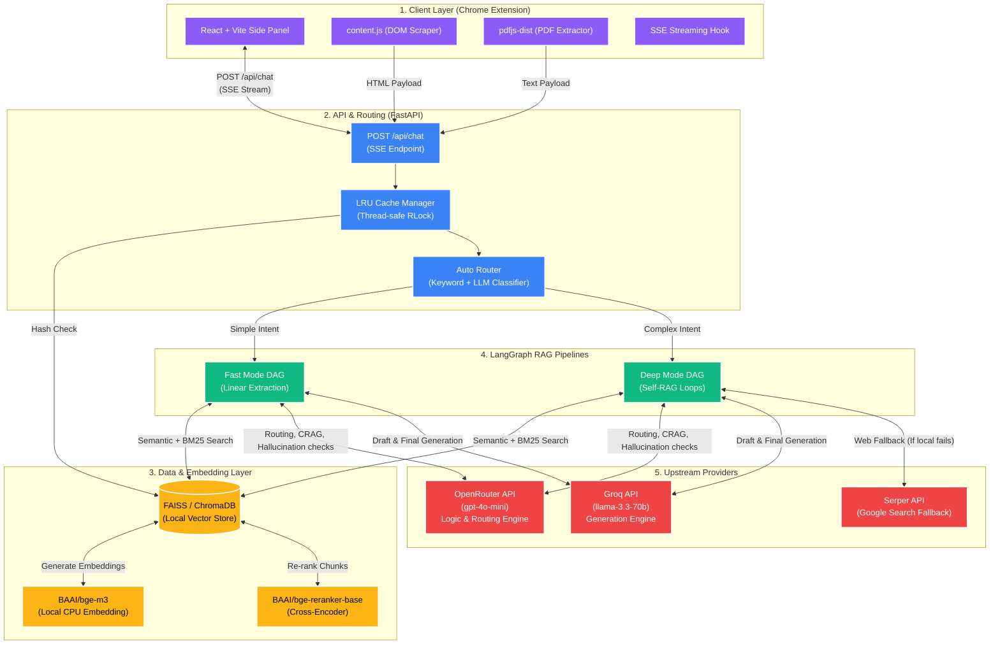
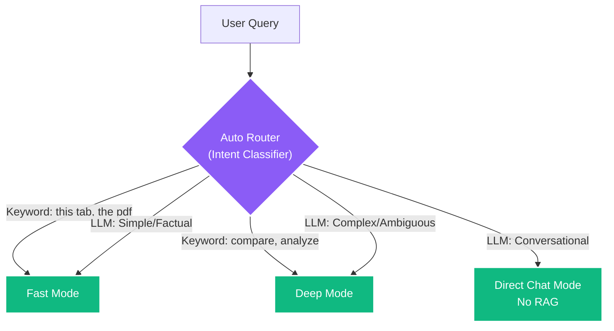
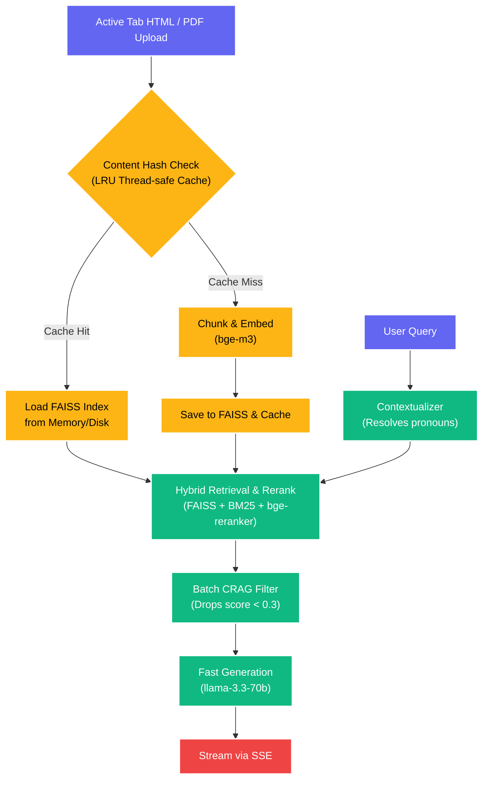
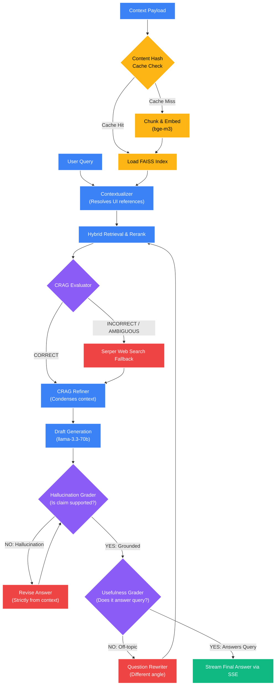

<p align="center">
  
</p>

# 🧠 ThinkTab AI

> **Your Contextual Web Assistant**

ThinkTab AI is a powerful, contextual AI research assistant packaged as a Google Chrome Extension. It seamlessly integrates into your browsing experience via the Chrome side panel, allowing you to ask complex questions, extract insights, and summarize the content of the webpages you are currently reading. 

ThinkTab AI operates with a **Soft Human-in-the-Loop (HITL)** design, providing instant responses with the option to escalate complex tasks to a deeper, self-evaluating reasoning pipeline.

---

## 🌟 Advanced Features

- **Multi-Tab Context Awareness:** ThinkTab is not limited to just your active tab. You can "pin" multiple tabs, and ThinkTab will seamlessly aggregate and search across all pinned tabs plus your current active tab to answer cross-reference queries.
- **Dynamic PDF Attachment Support:** Upload a local PDF file, and ThinkTab will extract the text entirely on the client side (using `pdfjs-dist`) and inject it into your context window alongside your web pages. 
- **Intelligent UI Label Resolution:** ThinkTab understands that when you type "this tab", "the pdf", or "the pinned tab", you are referring to a specific loaded document. It uses a structured LLM router to map these UI terms to the exact document IDs deterministically, preventing confusing general knowledge hallucinations.
- **Soft Human-in-the-Loop (HITL):** Need a quick answer? Use Fast Mode. If the answer isn't detailed enough, you can seamlessly escalate to Deep Mode with a single click, allowing the AI to re-read the context and perform rigorous self-evaluation.
- **Hybrid Retrieval & Score Normalization:** ThinkTab uses a dual-engine search (ChromaDB Semantic + rank-bm25 Keyword) merged via Reciprocal Rank Fusion (RRF). FAISS scores are normalized per-source on a `0.0-1.0` scale, completely eliminating the "Active Tab Dominance" bias and ensuring fair, accurate cross-document synthesis.

---

## 🛠️ Tech Stack & Architecture

ThinkTab AI uses a robust split architecture, pairing a fast client-side Chrome Extension with a heavy-duty Python local backend.



### Frontend (Chrome Extension)
- **Framework:** React 18 & TypeScript 5
- **Build Tool:** Vite 5
- **Styling:** Tailwind-inspired Vanilla CSS (Glassmorphism & Dark Mode)
- **Features:** Client-Side PDF Extraction (`pdfjs-dist`), Chrome Extension APIs (`sidePanel`, `activeTab`, `scripting`)

### Backend (Local Python Server)
- **Framework:** FastAPI & Uvicorn for Server-Sent Events (SSE) streaming
- **Orchestration:** LangChain & LangGraph for orchestrating the multi-agent RAG pipeline
- **Vector DB:** ChromaDB for persistent local vector caching
- **Embeddings:** BAAI/bge-m3 (runs on CPU) for 1024-dimensional document embeddings
- **Re-ranking:** BAAI/bge-reranker-base for cross-encoder search re-ranking
- **LLMs:** 
  - **Fast Brain:** GPT-4o-mini (via OpenRouter) for routing, CRAG scoring, and evaluation
  - **Smart Brain:** Llama-3.3-70B (via Groq) for final answer generation
- **Web Search:** Serper API for Google Search fallback

---

## 🧠 Fast Mode vs. Deep Mode (The RAG Pipeline)

When you ask a question, ThinkTab's **Auto Router** analyzes your intent and determines the best RAG (Retrieval-Augmented Generation) pipeline for the job.



### ⚡ Fast Mode
Designed for speed and simple factual extraction. 
1. **Contextualization**: Resolves pronouns (e.g. "summarize *it*").
2. **Retrieve & Rerank**: Fetches relevant chunks from ChromaDB and cross-encodes them.
3. **Batch CRAG Filter**: Swiftly drops irrelevant chunks.
4. **Generate**: Streams the answer directly to the UI.



### 🕵️ Deep Mode (Self-RAG)
Designed for complex comparisons, evaluations, and ambiguous queries. LangGraph orchestrates a multi-step Directed Acyclic Graph (DAG) with self-correction loops.
1. **Contextualization & Retrieval**: Same initial steps as Fast Mode.
2. **CRAG Evaluation**: Critiques the quality of the retrieved context. If the context is ambiguous or insufficient, it triggers a **Web Search Fallback** via Google.
3. **CRAG Refiner**: Condenses all gathered context (local + web) into a hyper-dense knowledge block.
4. **Generate Draft**: Llama 3 generates a draft answer.
5. **Hallucination Grader**: Checks if the draft is strictly grounded in the provided context. If not, it forces a rewrite.
6. **Usefulness Grader**: Checks if the answer actually resolves your original question.
7. **Automated Rewriting**: If the answer fails the Usefulness check, the **Question Rewriter** dynamically rephrases your original query and triggers a full **Re-Retrieval** loop to try again from a new angle.



---

## 🚀 Getting Started

Follow these instructions to run the ThinkTab AI backend server and install the Chrome Extension.

### 1. Prerequisites
- **Python 3.11+**
- **Node.js 18+**
- **Chrome browser**

### 2. Environment Variables
Create a `.env` file in the root directory (`ThinkTab-AI/.env`) and add your API keys:
```env
OPENROUTER_API_KEY=your_openrouter_key
GROQ_API_KEY=your_groq_key
SERPER_API_KEY=your_serper_key
```

### 3. Backend Setup

You can run the backend either via **Docker** (Recommended) or locally using a Python virtual environment.

#### Option A: Using Docker (Recommended)
This method ensures you don't have to manage local Python dependencies. It also mounts your local models so you don't redownload them every time.
1. Ensure Docker Desktop is running.
2. From the root directory (`ThinkTab-AI/`), start the container:
   ```bash
   docker-compose up -d --build
   ```
3. The server will run in the background at `http://localhost:8000`. You can view logs with `docker-compose logs -f`.

#### Option B: Local Python Environment
1. Navigate to the `backend` directory:
   ```bash
   cd backend
   ```
2. Create and activate a Python virtual environment:
   ```bash
   python -m venv venv
   # On Windows:
   venv\Scripts\activate
   # On Mac/Linux:
   source venv/bin/activate
   ```
3. Install dependencies:
   ```bash
   pip install -r requirements.txt
   ```
4. Start the FastAPI server:
   ```bash
   uvicorn app.main:app --reload
   ```
   *(Note: The first run will automatically download the local embedding models (~1.2GB) which may take a few minutes).*

### 4. Frontend Build
1. Open a new terminal and navigate to the `frontend` directory:
   ```bash
   cd frontend
   ```
2. Install Node dependencies:
   ```bash
   npm install
   ```
3. Build the React extension:
   ```bash
   npm run build
   ```
   *This outputs the final extension files into the `frontend/dist/` folder.*

### 5. Install the Extension in Chrome
1. Open Google Chrome and navigate to `chrome://extensions/`.
2. Turn on **Developer mode** (toggle in the top right corner).
3. Click the **Load unpacked** button.
4. Select the `ThinkTab-AI/frontend/dist/` folder.
5. Pin the ThinkTab AI extension to your browser toolbar.
6. Click the extension icon to open the Side Panel and start chatting!

---

## 📂 Project Structure

```text
ThinkTab-AI/
├── backend/               # FastAPI & LangChain Python server
│   ├── app/
│   │   ├── api/           # API routes (/chat, /embed)
│   │   ├── core/          # Pydantic configuration & env loading
│   │   ├── graph/         # LangGraph state & nodes (Fast/Deep mode)
│   │   └── services/      # Vector store & LLM singletons
│   └── tests/             # Pytest backend tests
└── frontend/              # React & Vite Chrome Extension
    ├── public/            # Chrome manifest & background/content scripts
    └── src/
        ├── components/    # UI components (ChatShell, UI Bubbles)
        └── hooks/         # Custom hooks (SSE chat, PDF parser)
```

---

## 🧪 Running Tests

### Backend Tests
Ensure your virtual environment is activated, then run:
```bash
cd backend
python -m pytest tests/ -v
```

### Frontend Tests
Navigate to the frontend directory and run Vitest:
```bash
cd frontend
npm run test
```

---

## 🤝 Contributing

We welcome contributions! 
1. Fork the repository.
2. Create a new feature branch (`git checkout -b feature/amazing-feature`).
3. Commit your changes (`git commit -m 'feat: add amazing feature'`).
4. Push to the branch (`git push origin feature/amazing-feature`).
5. Open a Pull Request.

Please ensure all tests pass and your code is properly linted before submitting.

---

## 📄 License

This project is licensed under the MIT License.
